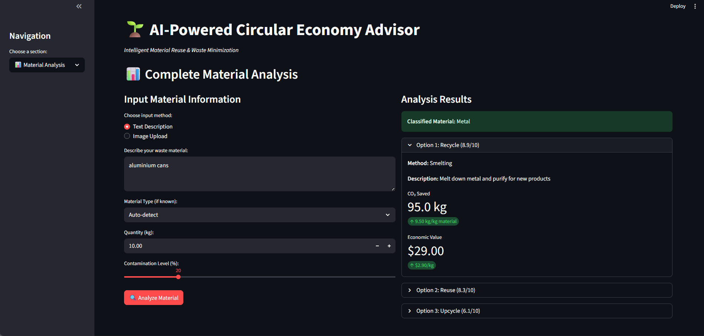
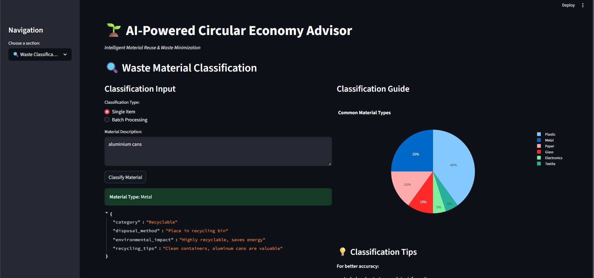
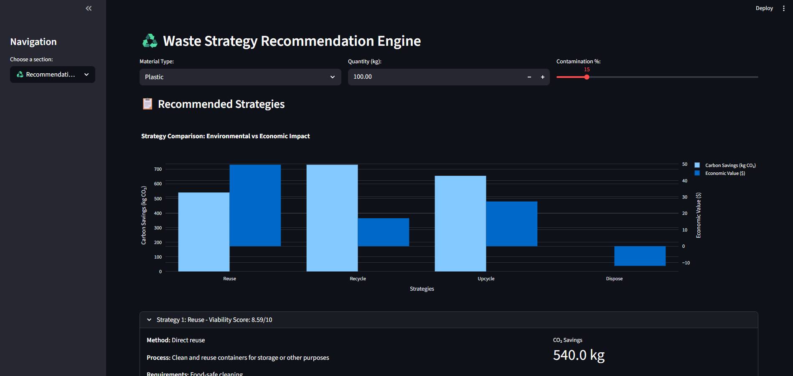
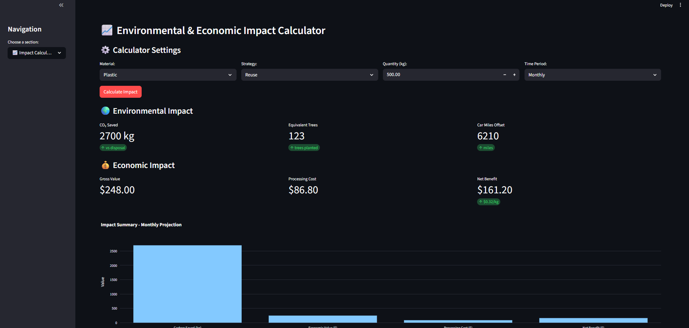

# EcoAdviser – AI Powered Circular Economy Advisor

EcoAdviser is an AI-powered platform designed to help industries make smarter decisions about waste management by recommending the best end-of-life strategy for materials. It leverages **machine learning, material science, and impact analysis** to promote sustainability, reduce costs, and accelerate the transition toward a **circular economy**.

---

## 🌍 Problem Statement

Every day, companies generate tons of waste but lack smart tools to determine whether to:

* **Reuse** – use material again,
* **Recycle** – process into raw material,
* **Upcycle** – convert into higher-value products, or
* **Dispose** responsibly.

This inefficiency leads to:

* Loss of valuable resources,
* Higher costs in waste handling, and
* Increased carbon emissions, harming the environment.

---

## 🚀 Introduction

EcoAdviser is a **ML-powered system** that:

* Classifies waste materials using text/image input,
* Recommends the best end-of-life strategy (reuse, recycle, upcycle, dispose),
* Integrates **economic viability** (market demand & cost analysis),
* Calculates **carbon footprint reduction**, and
* Provides actionable insights via an **interactive dashboard**.

🔗 GitHub Repo: [EcoAdviser](https://github.com/MithileshWatane/EcoAdviser)

---

## 👥 End Users

* Manufacturing Industries (Automotive, Electronics, Textiles, FMCG)
* Environmental & ESG Teams in companies
* Recyclers, Upcyclers, and secondary raw material markets
* Municipalities & Industrial Parks managing waste

---

## ✨ Key Features (Wow Factors)

* **Image Recognition** – Detect material type via uploaded photos.
* **Smart Recommendation Engine** – Balances cost vs. carbon savings.
* **Market Forecasting** – Predicts demand/prices for recyclables.
* **Carbon Calculator** – Quantifies CO₂ reduction instantly.
* **Marketplace Matching** – Connects with nearby buyers/recyclers.
* **Continuous Learning** – Improves with user feedback.

---

## 🔄 System Flow

1. **Input** – User uploads material description/image.
2. **Classification** – AI model identifies material type.
3. **Database Lookup** – Checks recyclability, properties, market demand.
4. **Impact Analysis** – Calculates cost savings + environmental effect.
5. **Recommendation** – Suggests best option (reuse / recycle / upcycle / dispose).
6. **Visualization** – Displays results with interactive graphs.

---

## 📊 Outcomes

* **Accuracy** – ≥ 90% in material classification.
* **CO₂ Reduction** – ≥ 25% compared to disposal baseline.
* **Economic Score** – Positive in ≥ 70% of tested cases.
* **Usability** – Upload → Recommendation in < 10 seconds.

---

## 🖼️ Screenshots

  
  

  
  

---

## ✅ Conclusion

EcoAdviser provides **clear, data-driven recommendations** for waste handling, enabling industries to:

* Lower costs,
* Reduce landfill waste, and
* Cut carbon footprints for a **greener future**.

This project demonstrates how **AI can drive sustainability and circular economy practices** at scale.

---

## 🔮 Future Perspective

* **Federated Learning** – Train AI without sharing sensitive data.
* **Geospatial Logistics** – Optimize routes for lowest emissions.
* **AI Copilots** – Auto-generate compliance docs & reports.
* **Blockchain** – Ensure traceability of recycled materials.
* **Global Standards** – Integrate with ESG/Scope-3 reporting tools.

